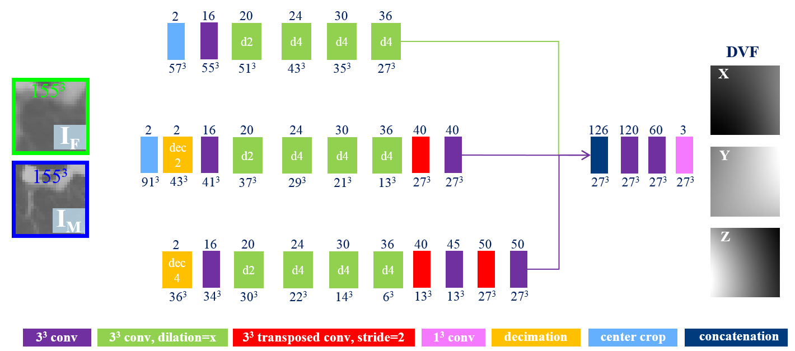

RegNet
==========

## Introduction
In this paper we propose a method to solve nonrigid image registration through a learning approach, instead of via iterative optimization of a predefined dissimilarity metric. We design a Convolutional Neural Network (CNN) architecture that, in contrast to all other work, directly estimates the displacement vector field (DVF) from a pair of input images. The proposed RegNet is trained using a large set of artificially generated DVFs, does not explicitly define a dissimilarity metric, and integrates image content at multiple scales to equip the network with contextual information. At testing time nonrigid registration is performed in a single shot, in contrast to current iterative methods.

### Citation

[1] Sokooti, H., de Vos, B., Berendsen, F., Lelieveldt, B.P., Išgum, I. and Staring, M., 2017, September. Nonrigid image registration using multi-scale 3D convolutional neural networks. In International Conference on Medical Image Computing and Computer-Assisted Intervention (pp. 232-239). Springer, Cham.
	
## 1. Requirements
- [numpy](http://www.numpy.org/) : General purpose array-processing package.
- [SciPy](https://www.scipy.org/) : A Python-based ecosystem of open-source software for mathematics, science, and engineering.
- [SimpleITK](http://www.simpleitk.org/) : Simplified interface to the Insight Toolkit for image registration and segmentation.
	

Figure 1: RegNet design.

Figure 2: Heat maps of the magnitude of DVFs used for training RegNet.